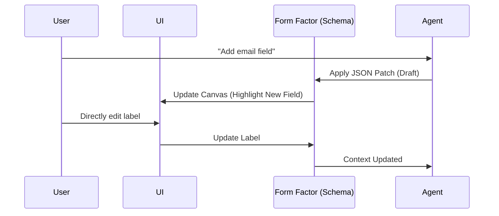

# AI Agent Interaction Protocol: Formia

The Formia Agent is not just a chatbot; it's a **Schema Co-Author**.

## 1. Interaction Lifecycle

1.  **User Prompt**: "Make the background look like a starry night and add a field for email."
2.  **Context Assembly**:
    - Current `form_factor.json`
    - Design System constraints (allowed tokens)
    - Available Block Types
3.  **Agent Reasoning**: Determines which parts of the schema need to change.
4.  **Schema Patch Generation**:
    - Agent generates a sequence of **JSON Patches (RFC 6902)** instead of the full schema.
    - **Mechanism**:
      - **JSON Mode & Response Schema**: For models that support it (OpenAI, Gemini), we enforce a strict **Response Schema**. This guarantees the output is always a valid JSON array or object that follows the RFC 6902 structure.
      - **Few-shot examples**: The prompt includes examples to ensure the path logic (e.g., `/blocks/-` for appending) is understood.
    - **Validation**: Patches are validated against a local JSON Schema validator before being applied to the in-memory Factor.
5.  **Draft Preview**: The UI reflects changes in a "Draft" state (e.g., glowing borders).
6.  **Human Confirmation/Revert**: User accepts, adjusts, or **Undoes** the AI-generated patch.
7.  **Commit to History**: Once accepted, the change is saved into the Form Factor History for full auditability.

## 2. System Instructions (Prompt Principles)

The Agent should be instructed with:

- **Design Guidelines**: "Prefer minimalist, Araform-like layouts."
- **UX Best Practices**: "Always suggest labels and help text for accessibility."
- **Constraint Awareness**: "Only use defined theme tokens."

## 3. The "Side-by-Side" Sync

## 4. Multi-LLM Adaptability

- **Gemini**: excels at multimodal context (if we support image-to-form).
- **OpenAI/Claude**: excels at precise JSON adherence and code-like logic.
- **Unified Adapter**: All models must output the same JSON Patch format.

## 5. BYOK (Bring Your Own Key) — API 키 관리

Formia는 **사용자가 자신의 AI API 키를 사용**합니다 (서비스 비용 부담 제로).

### 5.1 환경별 키 처리

| 환경 (Web/Desktop 공통) |  AI API 호출 방식  | 키 저장                  |
| ----------------------- | :----------------: | ------------------------ |
| **로그인 사용자**       | Backend Proxy 경유 | Envelope Encryption → DB |
| **비로그인 사용자**     | Backend Proxy 경유 | 세션 메모리 (임시)       |

### 5.2 핵심 규칙

- AI Adapter는 키를 메모리에서 받아 사용 후 즉시 클리어
- 키를 로그, 응답, 에러 리포트에 절대 포함하지 않음
- 모든 AI 요청은 `/api/ai/generate` 프록시를 통해 처리됨 (CORS 및 보안 중앙 관리)

> 상세 보안 설계: [Security Architecture](./security.md)
