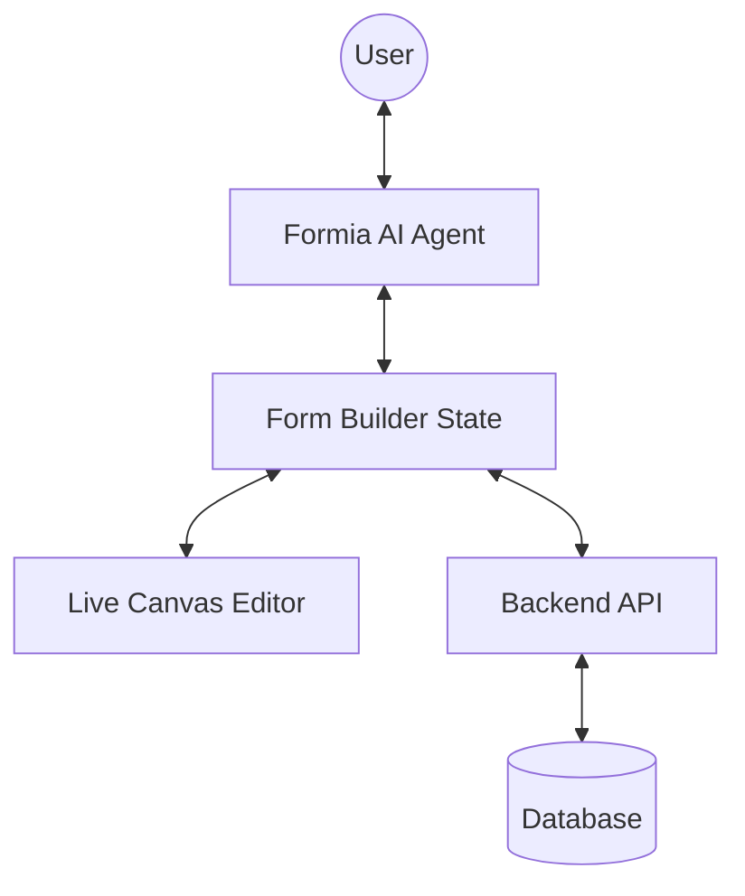

# Architecture Design: Formia

## 1. System High-Level Diagram

## 2. Key Components

### 2.1 The Agent-State Protocol

The AI agent doesn't just "talk"; it produces structured updates (JSON patches) to the form state.

- **Input**: User prompt + current form schema.
- **Output**: Proposed schema changes + explanatory natural language.

### 2.2 Frontend Architecture

- **State Management**: React Context or Zustand for the form schema.
- **Rendering Engine**: A dynamic renderer that parses the JSON schema and displays the corresponding components.
- **Canvas Interaction**: Direct manipulation (drag-and-drop) synced back to the AI context.

### 2.3 Data Model

## 4. The "Form Factor" (JSON Schema)

The core source of truth for every Formia form is the **Form Factor**. This is a highly structured JSON schema that describes both structure and style.

### 4.1 Schema Principles

- **Declarative**: The schema describes _what_ the form is, not _how_ to build it.
- **Bi-directional Sync**:
  - **Agent -> Factor**: The AI interprets natural language and emits JSON patches to modify the Factor.
  - **UI -> Factor**: Direct user interactions (drag-and-drop, field edits) update the same Factor in real-time.
- **Atomic Updates**: Updates should be granular (e.g., adding a single field, changing a color token) to ensure stability and easy undo/redo.

## 5. Deployment Strategy: Tauri Desktop App (Finalized)

Based on the goal of a zero-backend, high-performance, and secure (BYOK) experience, we will build Formia primarily as a **Desktop Application** using **Tauri**.

### 5.1 Why Tauri?

- **Small Binary Size**: Uses the system's native webview.
- **Improved Security**: Rust backend for sensitive operations (file system, API key management).
- **Frontend Agnostic**: Allows us to use Next.js 14+ for the UI.
- **Local Persistence**: Direct access to the local file system for saving `.formia` files.

### 5.2 Technical Stack

- **Framework**: Tauri (Rust backend)
- **Frontend**: Next.js 14 (App Router)
- **UI State**: Zustand (for Form Factor sync)
- **AI Integration**: Multi-provider SDKs (Gemini, OpenAI, Anthropic) via Tauri's `http` API or a local Rust-based proxy to handle CORS.
- **Data Format**: `.formia` (JSON)

## 6. History & Version Control

To support "Undo/Redo" and audit trails for both human and AI changes, Formia implements a robust history management system.

### 6.1 Command Pattern (In-Memory)

- Every modification to the Form Factor is encapsulated as a **Command**.
- **Undo Stack**: Stores the reverse operations of applied commands.
- **Redo Stack**: Stores commands that were undone.
- This allows for fine-grained, instantaneous undo/redo for the current session.

### 6.2 Change Tracking (Snapshotting vs. Diffs)

- **Snapshotting**: Every "major" change (e.g., AI interaction commit) creates a full snapshot of the Form Factor.
- **JSON Diffs (RFC 6902)**: We store the patches applied at each step. This is more storage-efficient and allows us to visualize the delta.

### 6.3 Local "Git-like" Versioning

- **Checkpoints**: Users can save "Checkpoints" (Versions).
- **History Metadata**: Each change in the history includes:
  - `author`: "human" or "ai"
  - `timestamp`: when the change occurred
  - `description`: "Added Age field" or "Changed primary color to Indigo" (AI-generated summary).
- **Storage**: History is stored alongside the `.formia` file (e.g., as a `.formia-history` JSON structure).
