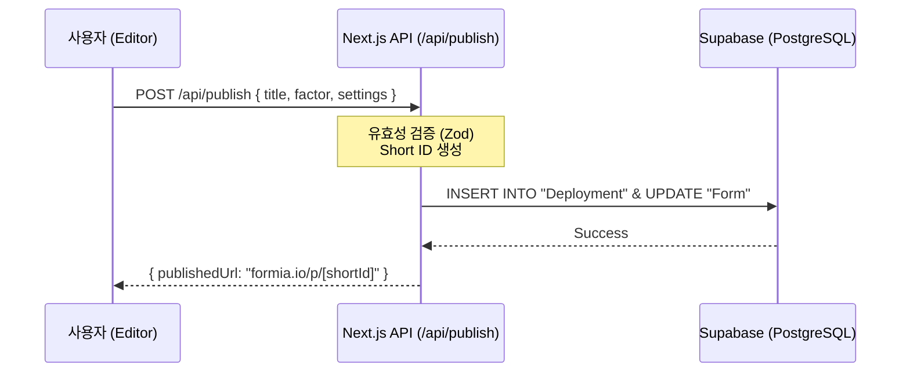
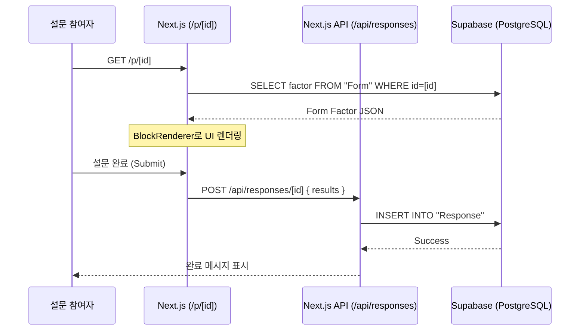

# Architecture: Zero-Cost Publishing Strategy

> 이 문서는 최소한의 비용(월 $0)으로 폼 배포 및 응답 수집 기능을 구현하기 위한 아키텍처를 다룹니다.
> 현재 백엔드 인프라가 없는 상태에서 빠르게 기능을 출시하기 위한 전략입니다.

## 1. 핵심 철학: Serverless First

별도의 전용 백엔드 서버(EC2, RDS 등)를 구축하지 않고, 모든 기능을 **Serverless 및 Free-tier Managed Service**로 구성하여 운영 비용을 $0으로 유지합니다.

| 레이어 | 기술 스택 | 비용 | 역할 |
| :--- | :--- | :--- | :--- |
| **Hosting** | **Vercel** | $0 (Hobby) | Next.js 앱 배포, SSR, API Routes 호스팅 |
| **Database** | **Supabase** | $0 (Free) | 폼 정의(JSON), 응답 데이터, 사용자 세션 저장 |
| **Functions** | **Next.js API Routes** | $0 | 배포 API, 응답 수집 API 처리 (Serverless) |
| **Client** | **Next.js (Web)** | $0 | 폼 편집기 및 공개 폼 뷰어 |

---

## 2. 데이터 흐름 및 컴포넌트

### 2.1 폼 배포 (Publishing) 플로우

사용자가 편집기에서 "배포" 버튼을 눌렀을 때의 흐름입니다.



### 2.2 공개 폼 참여 (Response) 플로우

배포된 폼에 다른 사람들이 접속하여 응답을 남길 때의 흐름입니다.



---

## 3. 세부 구현 전략

### 3.1 최소 DB 스키마 (Prisma)

이미 프로젝트에 설정된 Prisma를 활용하되, 프로덕션 환경에서는 Supabase(PostgreSQL)를 연결합니다.

```typescript
// prisma/schema.prisma

model Form {
  id        String   @id @default(cuid())
  title     String
  factor    Json     // 🔑 Form Factor JSON (pages, blocks, theme)
  ownerId   String
  isPublished Boolean @default(false)
  shortId   String?  @unique // 배포 시 생성되는 짧은 URL 키
  
  deployment Deployment?
  responses  Response[]
  
  createdAt DateTime @default(now())
  updatedAt DateTime @updatedAt
}

model Response {
  id          String   @id @default(cuid())
  formId      String
  data        Json     // 블록별 응답 결과
  metadata    Json?    // 브라우저 정보, 소요 시간 등
  submittedAt DateTime @default(now())

  form   Form @relation(fields: [formId], references: [id])
}
```

### 3.2 공개 뷰어 (Public Viewer) 재사용

새로운 코드를 최소화하기 위해 에디터의 **Preview 모드**에서 사용하던 `BlockRenderer`를 그대로 활용합니다.

- **`/app/p/[shortId]/page.tsx`**: 서버 컴포넌트에서 DB의 `factor`를 조회합니다.
- **`FormViewer` 컴포넌트**: 조회된 JSON을 `BlockRenderer`에 주입하여 렌더링합니다.
- **상태 관리**: 공개 뷰어에서는 Undo/Redo가 필요 없으므로 Zustand 대신 단순 React State만 사용하거나, `useFormStore`의 읽기 전용 모드를 사용합니다.

---

## 4. 비용 최적화 및 확장성

| 항목 | 전략 | 비고 |
| :--- | :--- | :--- |
| **트래픽 대응** | Next.js ISR (Incremental Static Regeneration) | 공개 폼을 정적 페이지로 캐싱하여 DB 부하 최소화 |
| **데이터 크기** | Form Factor JSON 압축 저장 | Supabase 무료 티어(500MB) 효율적 사용 |
| **보안** | Rate Limiting (Upstash / Vercel Edge) | 응답 수집 API에 대한 스팸 공격 방지 |

## 5. 단계별 실행 계획 (Roadmap)

1. **Step 1: 환경 설정**: Supabase 프로젝트 생성 및 `.env` 연결.
2. **Step 2: 배포 API**: `/api/publish` 엔드포인트 구현.
3. **Step 3: 공개 뷰어**: `/p/[id]` 페이지 구현 및 기존 Renderer 연동.
4. **Step 4: 응답 수집**: `/api/responses` 엔드포인트 구현.
5. **Step 5: 관리자 대시보드**: 응답 결과를 표/차트로 확인하는 간단한 UI 추가.

---

## 6. 결론

이 전략을 따르면 **추가 인프라 비용 없이** 기존 Next.js 코드베이스를 확장하여 강력한 배포 기능을 구현할 수 있습니다. 백엔드가 없다는 제약 사항은 Serverless 인프라를 통해 오히려 유지보수가 쉬운 구조로 해결됩니다.
